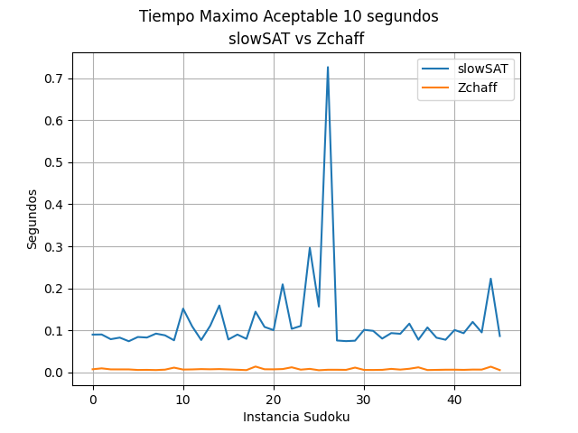

# CI5651-Design-of-Algorithms-I

El proyecto se compone de 3 programas y un orquestador que los hace trabajar juntos para resolver instacias de sudoku traduciendolas a formato cnf para resolverlas como un problema SAT, y luego convertir su solucion nuevamente en un sudoku. Para resolver, la instancia de SAT se diseño el resolvedor slowSAT, basado en el algoritmo DPLL, con una version de la heuristica VSIDS para guiar el backtracking. Adicionalmente el orquestador pasa las instancias tambien al resolvedor zchaff para hacer comparaciones de tiempo entre ambos.

## Como Correr el Proyecto

```bash
python3 orquestador.py InstanciasSudoku.py
```

## Programas

### sudokuToSad

Recibe el nombre del archivo que contiene el sudoku e imprime la instancia SAT en formato cnf equivalente a ese sudoku. Para esto se crean las clausulas de completitud, unicidad y validez, al igual que las clausulas para las casillas fijas. Antes de empezar a crear las clausulas, hace el cálculo para saber cuantas variables y clausulas se crearán para el "titulo" del SAT. Esto tiene complejidad O(n⁸) y utiliza memoria O(f + n⁸) donde f es el número de variables fijas.

Para las clausulas de casillas fijas simplemente se revisa el arreglo que contiene el sudoku y se guardan los números distintos a 0, ya que esto significa que esa casilla tiene un valor fijo, y luego se crea una clausula por cada variable fija, esto es la variable sola dentro de una clausula. Esto tiene complejidad O(n⁴).

Para las clausulas de completitud se crean clausulas de n² variables cada una donde en cada clausula estan todas las variables que equivalen a una misma casilla dentro del sudoku, por construcción todas las variables de una misma casilla se encuentran juntas (ej las primeras on variables generan la primera clausula).. Entonces itera sobre las n⁶ variables y va creando clausulas de n² variables cada una Esto tiene complejidad O(n⁶).

Para las clausulas de unicidad se itera sobre las n⁶ variables con pasos de n² variables (donde estas son las n² variables que equivalen a una misma casilla), luego se itera sobre esas n² variables, guardando el final, y despues se itera desde la siguiente variable hasta el final, y usamos la variable de la segunda iteracion, y la variable de la tercera iteracion para crear la clausula. De esta forma se genera una comparacion de todas con todas sin repetir clausulas. Esto tiene complejidad O(n⁸).

Para las clausulas de validez hay que tomar en cuenta validez por fila, por columna y por sección.
Para la validez por fila y por columna se utilizo el mismo concepto (Incluso, la misma iteración) donde primero se itera sobre las n⁶ variables con paso de n⁴ (el numero de variables necesarias para cambiar de fila), luego se itera sobre estas n⁴ variables de forma que estamos iterando sobre las variables de una misma fila. Despues iteramos desde la siguiente variable en la fila hasta la última de la fila con saltos de variable en variable (n² para la siguiente variable en la fila) de esta forma hacemos una comparación de todas con todas sin repetir clausulas. Justo despues de esto se utiliza el mismo concepto para las columnas, en el que, se itera desde la siguiente variable en la columna hasta la ultima con saltos de variable en variable (n⁴ para la siguiente variable en la columna). Esto tiene complejidad O(n⁸).

Para la validez por sección fue mas complicado. La idea fue construir una fila con cada sección, para hacer más facil la traducción. Primero se hacen dos iteraciones anidadas sobre n donde i,j equivalen a la fila y columna de la seccion donde estamos trabajando. Adentro se hacen dos iteraciones anidadas sobre n donde k,l equivalen a la fila y columna de la casilla dentro de la seccion donde estamos trabajando. Luego se itera sobre n² porque este es el numero de variables de cada casilla, dentro de esta iteracion se agregan a un arreglo todas las variables de casillas que se encuentran dentro de la sección. Luego de hacer esto, cuando ya esta creado el arreglo con todas las variables, se hace una llamada a la funcion resuelve, que se encarga de utilizar este arreglo para generar las clausulas, esto se hace de la misma forma en la que se generan las clausulas de validez por fila. Esto tiene complejidad O(n⁸).

### slowSAT

Recibe como argumento un archivo en formato cnf y opcionalmente el tiempo maximo para resolverlo, si no se indica el valor predeterminado son 10 segundos. Muestra por la salida estandar el resultado encontrado en formato cnf. Los posibles resultados son:

Si se encontro respuesta:
```bash
s cnf 1 4
v 1
v 2
v -3
v 4
```

Si se encontro que era insatisfacible:
```bash
s cnf 0 4
```

Si no se pudo resolver en el tiempo:
```bash
s cnf -1 4
```

Luego de leer el archivo de entrada, creamos una lista de clausulas, cada clausula es a su vez una lista de variables. Tambien creamos una lista de tamaño igual al numero de variables que se inicializa en None indicando que no se le ha fijado ningun valor. Iniciamos el conteo del tiempo. Se ordenan ascendentemente las clausulas por el numero de variables que contienen. Despues creamos un diccionario donde cada llave es una variable y su valor es su numero de ocurrencias en todas las clausulas, esto es necesario para poder usar la heuristica VSIDS. Una vez inicializadas estas estructuras empezamos el DPLL.

Nuestra implementacion se basa en 2 casos, el caso1 se llama cuando la primera clausula es unitaria, por lo tanto no hay mas alternativa que fijar la variable, para satisfacer la clausula. Al fijar una variable debemos simplificar, este proceso consiste en eliminar todas las clausulas donde aparezca la variable fijada y eliminar de toda clausula su negado, pues esto ya no influye en el valor del resto de variables. El proceso de simplificar es lineal sobre las clausulas (asumiendo la eliminacion y el remover variables como operaciones constantes), pero tras recorrerlas las organiza, por lo que simplificar es O(c log(c)) sobre el numero de clausulas. El caso1 se ejecuta mientras que queden clausulas por resolver y la primera sea unitaria. El peor caso, para caso1 seria que todas las clasulas sean unitarias y de variables distintas, por lo que seria  O(c² log(c)) en tiempo, caso1 no usa memoria adicional.

El caso 2 es el que gestiona el backtracking, pues cuando la clausula no es unitaria, se debe tomar una decision respecto a que variable fijar. Por como funciona nuestro algoritmo siempre consideramos la clausula con el menor numero de variables para tomar el siguiente paso. La eleccion de la variable se hace siguiendo la heuristica VSIDS. El calculo de la variable escogida es lineal al numero de variables dentro de la clausula (que era la mas pequeña). Al hacer una llamada a caso se debe una nueva copia de las clausulas (para no alterar los valores originales debido al paso por referencia dentro de la recursion), esto en lineal en tiempo y memoria sobre el numero de clausulas (la gran mayoria de clausulas del sudoku son de 2 variables). Una vez dentro de case2 fijamos (fijar toma tiempo constante) y simplificamos la variable. 

Luego verificamos si aun quedan clausulas por resolver, si no, terminamos la ejecucion pues hemos satisfecho la formula, en caso contrario seguimos. Verificamos si aun nos queda de tiempo de ejecucion, si no, terminamos la ejecucion sin haber podido resolver, en caso contrario seguimos. Si la primera clausula es vacia, significa que al simplificar eliminamos el unico elemento de una clausula unitaria, por lo tanto con la eleccion de variables actual no podemos satisfacer dicha clausula, actualizamos los pesos de las variables que se encontraban en la clasula justo antes de la ultima simplificacion, actualizar los pesos es lineal sobre el numero de clausulas (nuevamente para el sudoku es es promedio constante esta actualizacion) y retornamos False. A continuacion, como en el main, verificamos si caemos en caso1 si no caso2 se llama asi mismo con la siguiente variable que indique VSIDS, intentando fijarla primero y si no funciona esa rama, luego se prueba con su negado, en caso de que ambas fallen se retrocede, si se llegase a la primera llamada de caso2 entonces es insatisfacible la formula.

Si se cae en el caso2 algoritmo siempre retorna a la primera llamada, y verifica su resultado. Primero se revisa si el tiempo es menor al tiempo limite, si se supero el tiempo se reporta que "No se encontro solucion", si aun queda tiempo se revisa el valor de retorno de caso2. Si retorno False, era Insatisfacible, si retorna True entonces el valor de las variables es una solucion valida. Cabe destacar que al retornar False en los estados intermedios significa que todavia quedan clausulas por resolver. Sin importar cual de los 3 casos anteriores la funcion escribirRespuesta se encarga de mostrar por la salida estandar el resultado en formato cnf, esto es en los casos 0 y -1 constante en memoria y tiempo, mientras que en el caso 1, es lineal en tiempo respecto al numero de variables y constante en memoria.

Llamemos v al numero de variables y c al numero de clausulas. Sabemos que el problema por fuerza bruta es O(2^v) en tiempo. El mejor caso es cuando puedes resolver todas las clausulas con el caso 1, esto es que luego de simplificar siempre queda al menos una clausula unitaria, si esto sucede se ejecuta simplificar a lo sumo el numero de clausulas, resultando en O(c² log(c)) en tiempo y memoria O(c + v). El peor caso del caso 2, es escoger las variables de la peor manera posible, es decir la manera que genera la mayor cantidad de conflictos, sin embargo la heuristica al asignarle mas peso a las variables que participan al encontrar un conflicto en una clausula, hace que el algoritmo "aprenda" de sus errores, por lo que O(2^v) en tiempo sigue siendo una cota superior pero que, como vemos en las corridas del sudoku, los tiempos son mucho mejores que si hicieramos fuerza bruta. El peor caso en memoria llega a ocupar O(v*c), pues se llega al maximo nivel de recursion, fijando todas las variables y copiando cada vez todas las clausulas -1.

### saToSudoku

Recibe el nombre del archivo de entrada como unico argumento, se espera que el contenido este en formato cnf. Revisa el primer numero despues de "s cnf ", pues su valor indica si se encontro solucion (1), si era insatisfacible (0) o si no se encontro por razones de tiempoImprime(-1). Imprime por la salida estandar el resultado encontrado del sudoku, revisando las variables positivas reportadas. O en caso de que no se haya encontrado imprime "No se pudo resolver", si era insatisfacible, imprime "Insatisfacible". Lineal en tiempo y memoria sobre el numero de variables.

### sudokuBonito

Para leer mas comodamente los resultados encontrados puede correr:
```bash
python3 sudokuBonito.py InstaciasSudoku.txt soluciones.txt
```
Esto imprima por la salida estandar el sudoku original y su solucion encontrada por slowSAT en forma de matriz. Este programa es lineal respecto al orden del sudoku en memoria, y O(i*n^2) en tiempo, donde i es el numero de instacias y n su orden.
```python
Instacia: 1

[0, 4, 0, 0, 0, 0, 1, 7, 9]     [8, 4, 5, 6, 3, 2, 1, 7, 9]
[0, 0, 2, 0, 0, 8, 0, 5, 4]     [7, 3, 2, 9, 1, 8, 6, 5, 4]
[0, 0, 6, 0, 0, 5, 0, 0, 8]     [1, 9, 6, 7, 4, 5, 3, 2, 8]
[0, 8, 0, 0, 7, 0, 9, 1, 0]     [6, 8, 3, 5, 7, 4, 9, 1, 2]
[0, 5, 0, 0, 9, 0, 0, 3, 0] --> [4, 5, 7, 2, 9, 1, 8, 3, 6]
[0, 1, 9, 0, 6, 0, 0, 4, 0]     [2, 1, 9, 8, 6, 3, 5, 4, 7]
[3, 0, 0, 4, 0, 0, 7, 0, 0]     [3, 6, 1, 4, 2, 9, 7, 8, 5]
[5, 7, 0, 1, 0, 0, 2, 0, 0]     [5, 7, 4, 1, 8, 6, 2, 9, 3]
[9, 2, 8, 0, 0, 0, 0, 6, 0]     [9, 2, 8, 3, 5, 7, 4, 6, 1]

Instacia: 2

[0, 4, 0, 0, 0, 0, 1, 7, 9]
[0, 0, 2, 0, 0, 8, 0, 5, 4]
[0, 0, 6, 0, 0, 5, 0, 0, 8]
[0, 8, 0, 0, 7, 0, 9, 1, 0]
[0, 5, 0, 0, 9, 0, 0, 3, 0] --> Insatisfacible
[0, 1, 9, 0, 6, 0, 0, 4, 0]
[3, 0, 0, 4, 0, 0, 7, 3, 0]
[5, 7, 0, 1, 0, 0, 2, 0, 0]
[9, 2, 8, 0, 0, 0, 0, 6, 0]
```

### Orquestador

Se encarga de correr en secuencia los tres programas anteriores con el objetivo de tomar un archivo de instancias de sudoku y regresar los resultados de nuestro solver y zchaff, en cuanto a tiempo y solucion concreta de la instancia, para asi compararlos. Para lograr conectar los 4 programas, sus salidas se redireccionan en archivos temporales intermedios: sudoku.txt , sat.txt , satSolucion.txt y soluciones.txt , este ultimo no se elimina para poder verificar las soluciones. Tras pasar todas las instacias por ambos resolvedores, se imprimen los tiempos registrados y se grafican respecto al tiempo. No tomando en cuenta la complejidad de los subprogramas, el orquestador es lineal en tiempo y memoria respecto al numero de instacias del archivo de entrada.
Se utiliza os para ejecutar los programas y redireccionar sus entradas, time para contar el tiempo justo antes y justo despues de que actuen los solvers, y matplotlib para graficar.

### Resultados

Al correr el programa orquestador.py, se lee la entrada en el archivo que se proporcione como parametro, se espera que cada linea cumpla el formato:
```
3 040000179002008054006005008080070910050090030019060040300400700570100200928000060
```

Luego se procede a resolver cada sudoku, uno a la vez, escribiendolos en un archivo temporal sat.txt que contiene la informacion en formato cnf, para que nuestro solver y zchaff intenten dar una respuesta en menos de 10 segundos. Las soluciones se almacenan en el archivo soluciones.txt, las respuesta se encuentran en el mismo formato que la entrada del orquestador. Para cada solucion encontrada, en caso de que no se resolviera en el tiempo en la linea correspondiente se escribe "No se pudo resolver", en caso de que se encontrara que no era satisfacible se  escribe "Insatisfacible".

A continuacion se muestran los tiempos (en segundos) obtenidos obtenidos al correr el orquestador sobre InstaciasSudoku.txt

Instancia | Tiempo slowSat | Tiempo slowSat (Mejorado)| Tiempo Zchaff
--- | --- | --- | --- 
01| 1.223112 | 0.090257 | 0.007797
02| 1.316653 | 0.090512 | 0.009988
03| 1.508947 | 0.079273 | 0.007537
04| 1.425423 | 0.083042 | 0.007487
05| 1.493197 | 0.074431 | 0.007456
06| 1.349225 | 0.084527 | 0.006181
07| 1.361644 | 0.083220 | 0.006379
08| 1.547045 | 0.092555 | 0.005950
09| 1.442416 | 0.088462 | 0.006896
10| 1.535233 | 0.076641 | 0.011654
11| 1.591825 | 0.151959 | 0.007129
12| 2.052636 | 0.109845 | 0.007456
13| 1.793058 | 0.077325 | 0.008200
14| 1.456931 | 0.111399 | 0.007753
15| 1.367632 | 0.159457 | 0.008249
16| 1.347999 | 0.078562 | 0.007495
17| 1.399394 | 0.090343 | 0.006684
18| 1.315563 | 0.080112 | 0.005817
19| 1.273394 | 0.144706 | 0.014253
20| 1.262050 | 0.108427 | 0.007790
21| 1.467901 | 0.100799 | 0.007651
22| 5.822892 | 0.209726 | 0.008305
23| 1.285618 | 0.103953 | 0.012450
24| 1.845202 | 0.110783 | 0.006874
25| 9.205759 | 0.296753 | 0.008754
26| 2.092551 | 0.156863 | 0.005519
27| 3.580093 | 0.726244 | 0.006671
28| 1.283941 | 0.076182 | 0.006654
29| 1.264453 | 0.074706 | 0.006411
30| 1.347236 | 0.075727 | 0.011738
31| 1.319469 | 0.101518 | 0.006242
32| 1.288820 | 0.099137 | 0.006155
33| 1.838130 | 0.080749 | 0.006429
34| 2.953931 | 0.093773 | 0.008724
35| 2.201638 | 0.092111 | 0.007002
36| 5.250657 | 0.116258 | 0.009005
37| 1.320072 | 0.078021 | 0.012386
38| 1.337676 | 0.107288 | 0.005987
39| 1.422000 | 0.082822 | 0.006339
40| 1.258744 | 0.077958 | 0.006775
41| 1.373603 | 0.101228 | 0.006813
42| 1.340081 | 0.093529 | 0.006397
43| 2.102494 | 0.120400 | 0.007094
44| 4.142258 | 0.095359 | 0.007039
45| 2.078362 | 0.223196 | 0.013929
46| 1.877669 | 0.086751 | 0.005854

La siguiente grafica refleja estos resultados

 

A continuacion se muestran las soluciones encontradas por slowSAT

```python
Instacia: 1

[0, 4, 0, 0, 0, 0, 1, 7, 9]     [8, 4, 5, 6, 3, 2, 1, 7, 9]
[0, 0, 2, 0, 0, 8, 0, 5, 4]     [7, 3, 2, 9, 1, 8, 6, 5, 4]
[0, 0, 6, 0, 0, 5, 0, 0, 8]     [1, 9, 6, 7, 4, 5, 3, 2, 8]
[0, 8, 0, 0, 7, 0, 9, 1, 0]     [6, 8, 3, 5, 7, 4, 9, 1, 2]
[0, 5, 0, 0, 9, 0, 0, 3, 0] --> [4, 5, 7, 2, 9, 1, 8, 3, 6]
[0, 1, 9, 0, 6, 0, 0, 4, 0]     [2, 1, 9, 8, 6, 3, 5, 4, 7]
[3, 0, 0, 4, 0, 0, 7, 0, 0]     [3, 6, 1, 4, 2, 9, 7, 8, 5]
[5, 7, 0, 1, 0, 0, 2, 0, 0]     [5, 7, 4, 1, 8, 6, 2, 9, 3]
[9, 2, 8, 0, 0, 0, 0, 6, 0]     [9, 2, 8, 3, 5, 7, 4, 6, 1]

Instacia: 2

[8, 0, 2, 0, 5, 0, 7, 0, 1]     [8, 3, 2, 4, 5, 6, 7, 9, 1]
[0, 0, 7, 0, 8, 2, 4, 6, 0]     [9, 5, 7, 1, 8, 2, 4, 6, 3]
[0, 1, 0, 9, 0, 0, 0, 0, 0]     [4, 1, 6, 9, 7, 3, 2, 5, 8]
[6, 0, 0, 0, 0, 1, 8, 3, 2]     [6, 7, 9, 5, 4, 1, 8, 3, 2]
[5, 0, 0, 0, 0, 0, 0, 0, 9] --> [5, 2, 3, 7, 6, 8, 1, 4, 9]
[1, 8, 4, 3, 0, 0, 0, 0, 6]     [1, 8, 4, 3, 2, 9, 5, 7, 6]
[0, 0, 0, 0, 0, 4, 0, 2, 0]     [7, 6, 1, 8, 3, 4, 9, 2, 5]
[0, 9, 5, 6, 1, 0, 3, 0, 0]     [2, 9, 5, 6, 1, 7, 3, 8, 4]
[3, 0, 8, 0, 9, 0, 6, 0, 7]     [3, 4, 8, 2, 9, 5, 6, 1, 7]

Instacia: 3

[0, 0, 0, 0, 0, 0, 0, 0, 7]     [4, 9, 5, 6, 1, 8, 2, 3, 7]
[7, 2, 0, 3, 0, 9, 0, 0, 1]     [7, 2, 6, 3, 4, 9, 5, 8, 1]
[0, 0, 8, 7, 0, 5, 0, 6, 0]     [3, 1, 8, 7, 2, 5, 4, 6, 9]
[5, 0, 2, 8, 9, 0, 0, 0, 0]     [5, 7, 2, 8, 9, 4, 3, 1, 6]
[0, 4, 0, 5, 0, 1, 0, 9, 0] --> [6, 4, 3, 5, 7, 1, 8, 9, 2]
[0, 0, 0, 0, 6, 3, 7, 0, 5]     [1, 8, 9, 2, 6, 3, 7, 4, 5]
[0, 3, 0, 9, 0, 6, 1, 0, 0]     [8, 3, 7, 9, 5, 6, 1, 2, 4]
[2, 0, 0, 1, 0, 7, 0, 5, 3]     [2, 6, 4, 1, 8, 7, 9, 5, 3]
[9, 0, 0, 0, 0, 0, 0, 0, 0]     [9, 5, 1, 4, 3, 2, 6, 7, 8]

Instacia: 4

[2, 0, 6, 0, 0, 0, 0, 4, 9]     [2, 5, 6, 8, 3, 1, 7, 4, 9]
[0, 3, 7, 0, 0, 9, 0, 0, 0]     [8, 3, 7, 6, 4, 9, 5, 1, 2]
[1, 0, 0, 7, 0, 0, 0, 0, 6]     [1, 9, 4, 7, 2, 5, 3, 8, 6]
[0, 0, 0, 5, 8, 0, 9, 0, 0]     [6, 4, 1, 5, 8, 7, 9, 2, 3]
[7, 0, 5, 0, 0, 0, 8, 0, 4] --> [7, 2, 5, 1, 9, 3, 8, 6, 4]
[0, 0, 9, 0, 6, 2, 0, 0, 0]     [3, 8, 9, 4, 6, 2, 1, 7, 5]
[9, 0, 0, 0, 0, 4, 0, 0, 1]     [9, 7, 8, 2, 5, 4, 6, 3, 1]
[0, 0, 0, 3, 0, 0, 4, 9, 0]     [5, 6, 2, 3, 1, 8, 4, 9, 7]
[4, 1, 0, 0, 0, 0, 2, 0, 8]     [4, 1, 3, 9, 7, 6, 2, 5, 8]

Instacia: 5

[0, 2, 5, 0, 0, 7, 0, 0, 4]     [3, 2, 5, 8, 6, 7, 1, 9, 4]
[0, 0, 1, 0, 0, 5, 0, 2, 0]     [6, 8, 1, 4, 9, 5, 3, 2, 7]
[7, 0, 0, 0, 2, 0, 5, 0, 0]     [7, 9, 4, 3, 2, 1, 5, 6, 8]
[5, 0, 9, 0, 0, 4, 8, 0, 0]     [5, 3, 9, 6, 1, 4, 8, 7, 2]
[0, 0, 0, 0, 0, 0, 0, 0, 0] --> [2, 6, 8, 7, 3, 9, 4, 5, 1]
[0, 0, 7, 5, 0, 0, 6, 0, 9]     [4, 1, 7, 5, 8, 2, 6, 3, 9]
[0, 0, 3, 0, 7, 0, 0, 0, 6]     [1, 5, 3, 9, 7, 8, 2, 4, 6]
[0, 4, 0, 1, 0, 0, 7, 0, 0]     [9, 4, 2, 1, 5, 6, 7, 8, 3]
[8, 0, 0, 2, 0, 0, 9, 1, 0]     [8, 7, 6, 2, 4, 3, 9, 1, 5]

Instacia: 6

[0, 0, 1, 7, 2, 5, 0, 0, 0]     [3, 6, 1, 7, 2, 5, 9, 4, 8]
[0, 8, 0, 0, 1, 0, 0, 0, 6]     [9, 8, 7, 4, 1, 3, 2, 5, 6]
[2, 5, 0, 0, 0, 0, 1, 3, 0]     [2, 5, 4, 8, 6, 9, 1, 3, 7]
[0, 7, 0, 0, 0, 0, 5, 0, 0]     [8, 7, 6, 9, 3, 4, 5, 1, 2]
[0, 0, 0, 1, 0, 6, 0, 0, 0] --> [5, 2, 3, 1, 8, 6, 7, 9, 4]
[0, 0, 9, 0, 0, 0, 0, 8, 0]     [4, 1, 9, 2, 5, 7, 6, 8, 3]
[0, 4, 5, 0, 0, 0, 0, 2, 9]     [6, 4, 5, 3, 7, 1, 8, 2, 9]
[7, 0, 0, 0, 9, 0, 0, 6, 0]     [7, 3, 8, 5, 9, 2, 4, 6, 1]
[0, 0, 0, 6, 4, 8, 3, 0, 0]     [1, 9, 2, 6, 4, 8, 3, 7, 5]

Instacia: 7

[0, 5, 0, 2, 0, 0, 0, 0, 0]     [8, 5, 7, 2, 6, 1, 3, 9, 4]
[3, 0, 0, 0, 0, 5, 0, 8, 0]     [3, 1, 2, 4, 9, 5, 7, 8, 6]
[9, 6, 0, 0, 7, 8, 2, 0, 0]     [9, 6, 4, 3, 7, 8, 2, 1, 5]
[0, 0, 0, 0, 3, 0, 0, 2, 0]     [1, 9, 5, 7, 3, 4, 6, 2, 8]
[7, 0, 8, 0, 0, 0, 1, 0, 3] --> [7, 2, 8, 9, 5, 6, 1, 4, 3]
[0, 4, 0, 0, 8, 0, 0, 0, 0]     [6, 4, 3, 1, 8, 2, 5, 7, 9]
[0, 0, 1, 6, 4, 0, 0, 3, 2]     [5, 8, 1, 6, 4, 7, 9, 3, 2]
[0, 7, 0, 5, 0, 0, 0, 0, 1]     [4, 7, 9, 5, 2, 3, 8, 6, 1]
[0, 0, 0, 0, 0, 9, 0, 5, 0]     [2, 3, 6, 8, 1, 9, 4, 5, 7]

Instacia: 8

[0, 0, 1, 7, 2, 5, 0, 0, 0]     [3, 6, 1, 7, 2, 5, 9, 4, 8]
[0, 8, 0, 0, 1, 0, 0, 0, 0]     [9, 8, 7, 4, 1, 3, 2, 5, 6]
[2, 5, 0, 0, 0, 0, 1, 3, 0]     [2, 5, 4, 8, 6, 9, 1, 3, 7]
[0, 7, 0, 0, 0, 0, 5, 0, 0]     [8, 7, 6, 9, 3, 4, 5, 1, 2]
[0, 0, 0, 1, 8, 6, 0, 0, 0] --> [5, 2, 3, 1, 8, 6, 7, 9, 4]
[0, 0, 9, 0, 0, 0, 0, 8, 0]     [4, 1, 9, 2, 5, 7, 6, 8, 3]
[0, 4, 5, 0, 0, 0, 0, 2, 9]     [6, 4, 5, 3, 7, 1, 8, 2, 9]
[0, 0, 0, 0, 9, 0, 0, 6, 0]     [7, 3, 8, 5, 9, 2, 4, 6, 1]
[0, 0, 0, 6, 4, 8, 3, 0, 0]     [1, 9, 2, 6, 4, 8, 3, 7, 5]

Instacia: 9

[8, 0, 0, 2, 0, 0, 0, 4, 6]     [8, 9, 3, 2, 7, 5, 1, 4, 6]
[0, 0, 7, 9, 0, 0, 0, 0, 0]     [6, 5, 7, 9, 4, 1, 3, 2, 8]
[1, 0, 0, 0, 0, 0, 5, 0, 0]     [1, 4, 2, 6, 3, 8, 5, 9, 7]
[0, 0, 0, 5, 0, 0, 0, 3, 2]     [9, 7, 1, 5, 8, 4, 6, 3, 2]
[4, 0, 8, 0, 0, 0, 7, 0, 1] --> [4, 6, 8, 3, 2, 9, 7, 5, 1]
[3, 2, 0, 0, 0, 7, 0, 0, 0]     [3, 2, 5, 1, 6, 7, 9, 8, 4]
[0, 0, 6, 0, 0, 0, 0, 0, 9]     [5, 3, 6, 4, 1, 2, 8, 7, 9]
[0, 0, 0, 0, 0, 3, 2, 0, 0]     [7, 1, 4, 8, 9, 3, 2, 6, 5]
[2, 8, 0, 0, 0, 6, 0, 0, 3]     [2, 8, 9, 7, 5, 6, 4, 1, 3]

Instacia: 10

[0, 0, 0, 0, 5, 4, 3, 0, 6]     [1, 7, 2, 8, 5, 4, 3, 9, 6]
[0, 0, 0, 0, 0, 3, 2, 7, 0]     [4, 6, 8, 1, 9, 3, 2, 7, 5]
[0, 0, 0, 7, 2, 0, 0, 0, 1]     [5, 3, 9, 7, 2, 6, 4, 8, 1]
[9, 0, 0, 0, 7, 0, 0, 5, 3]     [9, 1, 4, 6, 7, 2, 8, 5, 3]
[0, 0, 0, 0, 0, 0, 0, 0, 0] --> [6, 5, 7, 3, 8, 9, 1, 2, 4]
[8, 2, 0, 0, 1, 0, 0, 0, 9]     [8, 2, 3, 4, 1, 5, 7, 6, 9]
[3, 0, 0, 0, 6, 1, 0, 0, 0]     [3, 8, 5, 2, 6, 1, 9, 4, 7]
[0, 4, 6, 9, 0, 0, 0, 0, 0]     [2, 4, 6, 9, 3, 7, 5, 1, 8]
[7, 0, 1, 5, 4, 0, 0, 0, 0]     [7, 9, 1, 5, 4, 8, 6, 3, 2]

Instacia: 11

[0, 5, 0, 0, 9, 0, 0, 0, 0]     [8, 5, 7, 3, 9, 2, 4, 1, 6]
[0, 0, 4, 8, 0, 0, 0, 0, 9]     [2, 1, 4, 8, 5, 6, 3, 7, 9]
[0, 0, 0, 1, 0, 7, 2, 8, 0]     [9, 3, 6, 1, 4, 7, 2, 8, 5]
[5, 6, 0, 0, 0, 0, 1, 3, 7]     [5, 6, 8, 4, 2, 9, 1, 3, 7]
[0, 0, 0, 0, 0, 0, 0, 0, 0] --> [4, 9, 2, 7, 3, 1, 6, 5, 8]
[1, 7, 3, 0, 0, 0, 0, 4, 2]     [1, 7, 3, 6, 8, 5, 9, 4, 2]
[0, 2, 1, 5, 0, 8, 0, 0, 0]     [3, 2, 1, 5, 6, 8, 7, 9, 4]
[6, 0, 0, 0, 0, 3, 8, 0, 0]     [6, 4, 5, 9, 7, 3, 8, 2, 1]
[0, 0, 0, 0, 1, 0, 0, 6, 0]     [7, 8, 9, 2, 1, 4, 5, 6, 3]

Instacia: 12

[0, 0, 0, 4, 0, 0, 7, 0, 2]     [3, 5, 9, 4, 8, 1, 7, 6, 2]
[0, 6, 4, 0, 0, 0, 0, 5, 0]     [7, 6, 4, 9, 2, 3, 8, 5, 1]
[1, 0, 0, 0, 0, 7, 0, 0, 9]     [1, 2, 8, 5, 6, 7, 3, 4, 9]
[2, 1, 0, 0, 0, 8, 0, 0, 3]     [2, 1, 5, 6, 7, 8, 4, 9, 3]
[0, 0, 0, 0, 5, 0, 0, 0, 0] --> [4, 7, 3, 2, 5, 9, 1, 8, 6]
[8, 0, 0, 1, 0, 0, 0, 7, 5]     [8, 9, 6, 1, 3, 4, 2, 7, 5]
[9, 0, 0, 7, 0, 0, 0, 0, 8]     [9, 4, 2, 7, 1, 6, 5, 3, 8]
[0, 8, 0, 0, 0, 0, 9, 2, 0]     [6, 8, 1, 3, 4, 5, 9, 2, 7]
[5, 0, 7, 0, 0, 2, 0, 0, 0]     [5, 3, 7, 8, 9, 2, 6, 1, 4]

Instacia: 13

[1, 0, 5, 0, 0, 0, 3, 7, 0]     [1, 2, 5, 6, 4, 9, 3, 7, 8]
[0, 0, 0, 0, 0, 0, 2, 0, 0]     [8, 3, 4, 7, 1, 5, 2, 9, 6]
[0, 9, 7, 3, 0, 0, 0, 1, 0]     [6, 9, 7, 3, 8, 2, 4, 1, 5]
[0, 0, 0, 0, 5, 3, 1, 0, 2]     [7, 4, 6, 9, 5, 3, 1, 8, 2]
[3, 0, 0, 8, 0, 1, 0, 0, 4] --> [3, 5, 9, 8, 2, 1, 7, 6, 4]
[2, 0, 1, 4, 7, 0, 0, 0, 0]     [2, 8, 1, 4, 7, 6, 9, 5, 3]
[0, 7, 0, 0, 0, 8, 6, 4, 0]     [5, 7, 3, 2, 9, 8, 6, 4, 1]
[0, 0, 8, 0, 0, 0, 0, 0, 0]     [4, 6, 8, 1, 3, 7, 5, 2, 9]
[0, 1, 2, 0, 0, 0, 8, 0, 7]     [9, 1, 2, 5, 6, 4, 8, 3, 7]

Instacia: 14

[0, 0, 1, 3, 0, 0, 7, 0, 2]     [8, 4, 1, 3, 6, 5, 7, 9, 2]
[0, 0, 6, 2, 0, 0, 0, 1, 0]     [7, 3, 6, 2, 9, 4, 8, 1, 5]
[0, 2, 0, 0, 0, 0, 0, 0, 4]     [5, 2, 9, 1, 8, 7, 6, 3, 4]
[2, 0, 0, 6, 0, 1, 3, 0, 9]     [2, 8, 5, 6, 7, 1, 3, 4, 9]
[0, 0, 0, 0, 0, 0, 0, 0, 0] --> [6, 9, 7, 4, 3, 2, 1, 5, 8]
[4, 0, 3, 8, 0, 9, 0, 0, 7]     [4, 1, 3, 8, 5, 9, 2, 6, 7]
[1, 0, 0, 0, 0, 0, 0, 8, 0]     [1, 7, 2, 5, 4, 3, 9, 8, 6]
[0, 5, 0, 0, 0, 6, 4, 0, 0]     [3, 5, 8, 9, 2, 6, 4, 7, 1]
[9, 0, 4, 0, 0, 8, 5, 0, 0]     [9, 6, 4, 7, 1, 8, 5, 2, 3]

Instacia: 15

[0, 0, 1, 7, 2, 5, 0, 0, 0]     [3, 6, 1, 7, 2, 5, 9, 4, 8]
[0, 8, 0, 0, 1, 0, 0, 0, 0]     [9, 8, 7, 4, 1, 3, 2, 5, 6]
[2, 5, 0, 0, 0, 0, 1, 3, 0]     [2, 5, 4, 8, 6, 9, 1, 3, 7]
[0, 7, 0, 0, 0, 0, 5, 0, 0]     [8, 7, 6, 9, 3, 4, 5, 1, 2]
[0, 0, 0, 1, 0, 6, 0, 0, 0] --> [5, 2, 3, 1, 8, 6, 7, 9, 4]
[0, 0, 9, 0, 0, 0, 0, 8, 0]     [4, 1, 9, 2, 5, 7, 6, 8, 3]
[0, 4, 5, 0, 0, 0, 0, 2, 9]     [6, 4, 5, 3, 7, 1, 8, 2, 9]
[0, 0, 0, 0, 9, 0, 0, 6, 0]     [7, 3, 8, 5, 9, 2, 4, 6, 1]
[0, 0, 0, 6, 4, 8, 3, 0, 0]     [1, 9, 2, 6, 4, 8, 3, 7, 5]

Instacia: 16

[0, 0, 8, 0, 6, 0, 9, 0, 0]     [2, 3, 8, 4, 6, 7, 9, 1, 5]
[0, 0, 0, 2, 0, 3, 6, 7, 8]     [4, 1, 5, 2, 9, 3, 6, 7, 8]
[7, 0, 6, 0, 5, 1, 0, 0, 4]     [7, 9, 6, 8, 5, 1, 2, 3, 4]
[9, 7, 3, 0, 4, 8, 1, 0, 0]     [9, 7, 3, 5, 4, 8, 1, 6, 2]
[6, 2, 0, 0, 3, 9, 0, 5, 0] --> [6, 2, 4, 1, 3, 9, 8, 5, 7]
[0, 0, 1, 7, 0, 0, 0, 0, 0]     [8, 5, 1, 7, 2, 6, 4, 9, 3]
[5, 8, 0, 9, 0, 0, 3, 0, 6]     [5, 8, 7, 9, 1, 2, 3, 4, 6]
[0, 0, 0, 0, 0, 0, 0, 0, 0]     [1, 6, 2, 3, 7, 4, 5, 8, 9]
[0, 4, 0, 0, 0, 5, 7, 2, 1]     [3, 4, 9, 6, 8, 5, 7, 2, 1]

Instacia: 17

[3, 0, 2, 0, 6, 5, 0, 4, 7]     [3, 1, 2, 8, 6, 5, 9, 4, 7]
[0, 5, 0, 0, 3, 4, 1, 8, 2]     [6, 5, 7, 9, 3, 4, 1, 8, 2]
[0, 9, 0, 1, 7, 0, 0, 6, 0]     [8, 9, 4, 1, 7, 2, 5, 6, 3]
[2, 0, 6, 0, 9, 0, 3, 0, 8]     [2, 4, 6, 7, 9, 1, 3, 5, 8]
[1, 0, 0, 0, 0, 0, 2, 7, 0] --> [1, 3, 5, 4, 8, 6, 2, 7, 9]
[0, 8, 9, 5, 0, 3, 4, 0, 0]     [7, 8, 9, 5, 2, 3, 4, 1, 6]
[4, 7, 0, 3, 0, 0, 0, 0, 5]     [4, 7, 8, 3, 1, 9, 6, 2, 5]
[0, 0, 0, 6, 4, 8, 0, 9, 1]     [5, 2, 3, 6, 4, 8, 7, 9, 1]
[0, 0, 0, 2, 0, 0, 0, 0, 0]     [9, 6, 1, 2, 5, 7, 8, 3, 4]

Instacia: 18

[0, 7, 1, 0, 3, 9, 0, 0, 0]     [2, 7, 1, 8, 3, 9, 5, 4, 6]
[4, 6, 0, 0, 7, 5, 0, 1, 0]     [4, 6, 9, 2, 7, 5, 8, 1, 3]
[8, 3, 0, 0, 6, 0, 7, 0, 2]     [8, 3, 5, 1, 6, 4, 7, 9, 2]
[0, 4, 2, 0, 0, 0, 0, 5, 8]     [3, 4, 2, 9, 1, 7, 6, 5, 8]
[6, 0, 0, 0, 0, 0, 9, 7, 0] --> [6, 5, 8, 4, 2, 3, 9, 7, 1]
[0, 1, 0, 5, 0, 0, 0, 0, 4]     [9, 1, 7, 5, 8, 6, 2, 3, 4]
[0, 0, 0, 0, 0, 8, 4, 6, 9]     [1, 2, 3, 7, 5, 8, 4, 6, 9]
[7, 9, 0, 3, 4, 2, 0, 0, 0]     [7, 9, 6, 3, 4, 2, 1, 8, 5]
[5, 0, 0, 0, 0, 1, 3, 0, 0]     [5, 8, 4, 6, 9, 1, 3, 2, 7]

Instacia: 19

[0, 0, 0, 0, 4, 0, 0, 0, 9]     [6, 7, 2, 8, 4, 1, 3, 5, 9]
[0, 0, 0, 7, 0, 0, 0, 0, 0]     [4, 9, 5, 7, 6, 3, 2, 8, 1]
[0, 0, 1, 0, 0, 0, 6, 0, 0]     [3, 8, 1, 9, 5, 2, 6, 7, 4]
[0, 1, 3, 6, 9, 0, 4, 0, 0]     [8, 1, 3, 6, 9, 7, 4, 2, 5]
[0, 0, 0, 0, 0, 0, 0, 0, 8] --> [5, 2, 6, 3, 1, 4, 7, 9, 8]
[0, 0, 0, 5, 2, 8, 0, 0, 0]     [7, 4, 9, 5, 2, 8, 1, 3, 6]
[0, 6, 7, 1, 8, 0, 0, 0, 0]     [2, 6, 7, 1, 8, 9, 5, 4, 3]
[0, 0, 0, 0, 0, 0, 9, 0, 2]     [1, 3, 8, 4, 7, 5, 9, 6, 2]
[9, 5, 4, 0, 3, 0, 0, 1, 0]     [9, 5, 4, 2, 3, 6, 8, 1, 7]

Instacia: 20

[0, 0, 2, 0, 0, 4, 0, 0, 0]     [3, 6, 2, 7, 9, 4, 1, 8, 5]
[0, 0, 8, 6, 0, 0, 0, 0, 0]     [5, 1, 8, 6, 2, 3, 7, 9, 4]
[0, 9, 0, 0, 0, 0, 0, 3, 0]     [4, 9, 7, 1, 8, 5, 2, 3, 6]
[8, 0, 0, 0, 6, 2, 0, 0, 0]     [8, 5, 9, 4, 6, 2, 3, 7, 1]
[1, 4, 0, 0, 3, 0, 5, 0, 9] --> [1, 4, 6, 8, 3, 7, 5, 2, 9]
[0, 7, 0, 0, 0, 0, 0, 0, 0]     [2, 7, 3, 5, 1, 9, 4, 6, 8]
[0, 3, 5, 0, 0, 8, 6, 0, 7]     [9, 3, 5, 2, 4, 8, 6, 1, 7]
[0, 0, 0, 0, 0, 0, 0, 4, 2]     [7, 8, 1, 3, 5, 6, 9, 4, 2]
[0, 0, 0, 9, 0, 1, 0, 0, 3]     [6, 2, 4, 9, 7, 1, 8, 5, 3]

Instacia: 21

[6, 7, 0, 0, 0, 8, 0, 1, 0]     [6, 7, 5, 9, 4, 8, 2, 1, 3]
[0, 2, 0, 0, 6, 0, 0, 0, 0]     [3, 2, 8, 1, 6, 5, 9, 7, 4]
[0, 0, 0, 0, 3, 0, 0, 0, 0]     [1, 4, 9, 7, 3, 2, 5, 6, 8]
[2, 0, 1, 0, 0, 0, 0, 0, 6]     [2, 9, 1, 3, 5, 7, 4, 8, 6]
[4, 8, 0, 0, 0, 1, 7, 0, 0] --> [4, 8, 6, 2, 9, 1, 7, 3, 5]
[0, 0, 0, 0, 0, 0, 0, 0, 9]     [5, 3, 7, 6, 8, 4, 1, 2, 9]
[0, 0, 4, 5, 0, 0, 0, 0, 0]     [8, 1, 4, 5, 2, 3, 6, 9, 7]
[0, 0, 0, 0, 0, 0, 3, 0, 0]     [9, 5, 2, 8, 7, 6, 3, 4, 1]
[0, 0, 3, 4, 0, 0, 8, 0, 2]     [7, 6, 3, 4, 1, 9, 8, 5, 2]

Instacia: 22

[0, 0, 0, 0, 0, 0, 0, 0, 0]     [3, 8, 4, 7, 2, 9, 1, 5, 6]
[1, 0, 0, 0, 4, 0, 0, 7, 0]     [1, 2, 5, 3, 4, 6, 9, 7, 8]
[7, 0, 0, 5, 0, 0, 0, 2, 0]     [7, 9, 6, 5, 8, 1, 4, 2, 3]
[0, 1, 7, 6, 0, 0, 5, 0, 0]     [4, 1, 7, 6, 9, 3, 5, 8, 2]
[0, 6, 0, 0, 0, 0, 3, 0, 0] --> [8, 6, 2, 4, 1, 5, 3, 9, 7]
[0, 0, 0, 8, 0, 2, 6, 0, 0]     [9, 5, 3, 8, 7, 2, 6, 1, 4]
[0, 0, 0, 9, 0, 0, 0, 4, 5]     [2, 3, 1, 9, 6, 7, 8, 4, 5]
[0, 0, 9, 2, 0, 8, 0, 0, 0]     [6, 4, 9, 2, 5, 8, 7, 3, 1]
[0, 0, 8, 0, 3, 0, 0, 0, 0]     [5, 7, 8, 1, 3, 4, 2, 6, 9]

Instacia: 23

[0, 0, 7, 0, 0, 1, 4, 0, 0]     [9, 8, 7, 5, 2, 1, 4, 6, 3]
[0, 6, 0, 0, 0, 0, 0, 0, 0]     [4, 6, 3, 9, 7, 8, 5, 1, 2]
[2, 0, 5, 0, 0, 0, 0, 0, 0]     [2, 1, 5, 3, 4, 6, 9, 8, 7]
[0, 0, 1, 7, 6, 0, 0, 5, 8]     [3, 4, 1, 7, 6, 9, 2, 5, 8]
[0, 0, 0, 0, 3, 0, 0, 0, 0] --> [7, 2, 6, 8, 3, 5, 1, 9, 4]
[0, 9, 0, 2, 0, 4, 0, 0, 0]     [5, 9, 8, 2, 1, 4, 3, 7, 6]
[0, 3, 0, 0, 5, 0, 0, 0, 9]     [1, 3, 2, 6, 5, 7, 8, 4, 9]
[0, 0, 4, 0, 0, 0, 6, 0, 0]     [8, 7, 4, 1, 9, 2, 6, 3, 5]
[0, 5, 0, 0, 8, 0, 7, 2, 1]     [6, 5, 9, 4, 8, 3, 7, 2, 1]

Instacia: 24

[9, 0, 3, 0, 0, 0, 0, 2, 4]     [9, 5, 3, 7, 8, 1, 6, 2, 4]
[0, 0, 7, 0, 9, 4, 0, 0, 0]     [6, 2, 7, 3, 9, 4, 5, 1, 8]
[0, 0, 1, 0, 0, 6, 0, 3, 0]     [8, 4, 1, 2, 5, 6, 9, 3, 7]
[0, 6, 4, 0, 0, 8, 0, 0, 0]     [3, 6, 4, 5, 1, 8, 2, 7, 9]
[0, 0, 0, 0, 0, 0, 0, 4, 0] --> [2, 9, 5, 6, 3, 7, 8, 4, 1]
[0, 0, 0, 9, 0, 0, 0, 5, 0]     [1, 7, 8, 9, 4, 2, 3, 5, 6]
[0, 0, 0, 0, 0, 3, 7, 0, 0]     [4, 1, 9, 8, 2, 3, 7, 6, 5]
[5, 0, 0, 0, 0, 0, 1, 0, 0]     [5, 3, 6, 4, 7, 9, 1, 8, 2]
[0, 8, 0, 0, 6, 0, 0, 0, 0]     [7, 8, 2, 1, 6, 5, 4, 9, 3]

Instacia: 25

[0, 4, 0, 0, 0, 0, 0, 0, 0]     [1, 4, 9, 7, 2, 5, 6, 8, 3]
[8, 0, 6, 0, 0, 0, 0, 0, 7]     [8, 2, 6, 4, 3, 1, 9, 5, 7]
[5, 0, 0, 0, 0, 0, 1, 0, 0]     [5, 7, 3, 8, 6, 9, 1, 4, 2]
[0, 0, 5, 1, 9, 0, 0, 6, 0]     [3, 8, 5, 1, 9, 7, 2, 6, 4]
[0, 0, 4, 0, 5, 0, 0, 0, 0] --> [9, 1, 4, 2, 5, 6, 3, 7, 8]
[0, 0, 0, 3, 0, 0, 0, 9, 1]     [2, 6, 7, 3, 8, 4, 5, 9, 1]
[0, 0, 0, 0, 0, 2, 4, 3, 6]     [7, 5, 8, 9, 1, 2, 4, 3, 6]
[0, 9, 0, 0, 0, 0, 0, 0, 0]     [4, 9, 2, 6, 7, 3, 8, 1, 5]
[0, 0, 0, 0, 0, 8, 0, 2, 0]     [6, 3, 1, 5, 4, 8, 7, 2, 9]

Instacia: 26

[0, 9, 0, 3, 8, 4, 0, 0, 0]     [1, 9, 7, 3, 8, 4, 5, 6, 2]
[0, 0, 2, 0, 7, 0, 0, 0, 0]     [8, 5, 2, 6, 7, 1, 9, 3, 4]
[0, 0, 0, 0, 0, 0, 0, 7, 1]     [4, 6, 3, 9, 5, 2, 8, 7, 1]
[5, 0, 0, 0, 0, 3, 2, 4, 0]     [5, 8, 9, 7, 1, 3, 2, 4, 6]
[0, 3, 0, 0, 0, 0, 0, 0, 0] --> [6, 3, 4, 2, 9, 8, 7, 1, 5]
[0, 0, 1, 0, 0, 5, 0, 9, 0]     [2, 7, 1, 4, 6, 5, 3, 9, 8]
[0, 0, 0, 8, 0, 0, 0, 0, 0]     [3, 1, 5, 8, 4, 7, 6, 2, 9]
[7, 0, 6, 5, 2, 0, 0, 0, 0]     [7, 4, 6, 5, 2, 9, 1, 8, 3]
[0, 0, 0, 0, 0, 6, 4, 0, 0]     [9, 2, 8, 1, 3, 6, 4, 5, 7]

Instacia: 27

[0, 2, 7, 0, 0, 0, 8, 0, 0]     [9, 2, 7, 1, 3, 6, 8, 4, 5]
[0, 0, 1, 0, 0, 0, 7, 0, 0]     [6, 4, 1, 9, 8, 5, 7, 2, 3]
[0, 0, 0, 4, 0, 0, 0, 0, 0]     [8, 3, 5, 4, 7, 2, 6, 9, 1]
[3, 0, 0, 0, 0, 0, 0, 8, 0]     [3, 6, 4, 7, 5, 9, 1, 8, 2]
[0, 5, 0, 0, 0, 0, 0, 0, 9] --> [2, 5, 8, 6, 1, 4, 3, 7, 9]
[0, 7, 0, 0, 2, 8, 0, 0, 0]     [1, 7, 9, 3, 2, 8, 5, 6, 4]
[0, 9, 0, 0, 6, 7, 0, 0, 0]     [4, 9, 3, 5, 6, 7, 2, 1, 8]
[5, 8, 0, 0, 0, 0, 0, 3, 0]     [5, 8, 6, 2, 9, 1, 4, 3, 7]
[0, 0, 0, 0, 4, 0, 0, 5, 6]     [7, 1, 2, 8, 4, 3, 9, 5, 6]

Instacia: 28

[0, 0, 2, 0, 0, 0, 5, 0, 0]     [9, 7, 2, 8, 6, 3, 5, 4, 1]
[0, 1, 0, 7, 0, 5, 0, 2, 0]     [6, 1, 8, 7, 4, 5, 9, 2, 3]
[4, 0, 0, 0, 9, 0, 0, 0, 7]     [4, 5, 3, 2, 9, 1, 6, 8, 7]
[0, 4, 9, 0, 0, 0, 7, 3, 0]     [5, 4, 9, 1, 2, 8, 7, 3, 6]
[8, 0, 1, 0, 3, 0, 4, 0, 9] --> [8, 2, 1, 6, 3, 7, 4, 5, 9]
[0, 3, 6, 0, 0, 0, 2, 1, 0]     [7, 3, 6, 4, 5, 9, 2, 1, 8]
[2, 0, 0, 0, 8, 0, 0, 0, 4]     [2, 9, 5, 3, 8, 6, 1, 7, 4]
[0, 8, 0, 9, 0, 2, 0, 6, 0]     [1, 8, 4, 9, 7, 2, 3, 6, 5]
[0, 0, 7, 0, 0, 0, 8, 0, 0]     [3, 6, 7, 5, 1, 4, 8, 9, 2]

Instacia: 29

[0, 5, 0, 0, 1, 0, 0, 4, 0]     [8, 5, 2, 7, 1, 6, 9, 4, 3]
[1, 0, 7, 0, 0, 0, 6, 0, 2]     [1, 9, 7, 8, 4, 3, 6, 5, 2]
[0, 0, 0, 9, 0, 5, 0, 0, 0]     [4, 6, 3, 9, 2, 5, 1, 8, 7]
[2, 0, 8, 0, 3, 0, 5, 0, 1]     [2, 7, 8, 6, 3, 4, 5, 9, 1]
[0, 4, 0, 0, 7, 0, 0, 2, 0] --> [6, 4, 5, 1, 7, 9, 3, 2, 8]
[9, 0, 1, 0, 8, 0, 4, 0, 6]     [9, 3, 1, 5, 8, 2, 4, 7, 6]
[0, 0, 0, 4, 0, 1, 0, 0, 0]     [7, 8, 6, 4, 9, 1, 2, 3, 5]
[3, 0, 4, 0, 0, 0, 7, 0, 9]     [3, 1, 4, 2, 5, 8, 7, 6, 9]
[0, 2, 0, 0, 6, 0, 0, 1, 0]     [5, 2, 9, 3, 6, 7, 8, 1, 4]

Instacia: 30

[0, 0, 0, 6, 0, 2, 0, 0, 0]     [1, 9, 3, 6, 7, 2, 4, 8, 5]
[4, 0, 0, 0, 5, 0, 0, 0, 1]     [4, 6, 2, 3, 5, 8, 9, 7, 1]
[0, 8, 5, 0, 1, 0, 6, 2, 0]     [7, 8, 5, 9, 1, 4, 6, 2, 3]
[0, 3, 8, 2, 0, 6, 7, 1, 0]     [5, 3, 8, 2, 9, 6, 7, 1, 4]
[0, 0, 0, 0, 0, 0, 0, 0, 0] --> [6, 7, 4, 1, 3, 5, 2, 9, 8]
[0, 1, 9, 4, 0, 7, 3, 5, 0]     [2, 1, 9, 4, 8, 7, 3, 5, 6]
[0, 2, 6, 0, 4, 0, 5, 3, 0]     [8, 2, 6, 7, 4, 1, 5, 3, 9]
[9, 0, 0, 0, 2, 0, 0, 0, 7]     [9, 4, 1, 5, 2, 3, 8, 6, 7]
[0, 0, 0, 8, 0, 9, 0, 0, 0]     [3, 5, 7, 8, 6, 9, 1, 4, 2]

Instacia: 31

[0, 0, 0, 0, 0, 0, 0, 0, 0]     [3, 4, 5, 8, 7, 1, 2, 6, 9]
[0, 7, 9, 0, 5, 0, 1, 8, 0]     [2, 7, 9, 6, 5, 3, 1, 8, 4]
[8, 0, 0, 0, 0, 0, 0, 0, 7]     [8, 6, 1, 4, 2, 9, 5, 3, 7]
[0, 0, 7, 3, 0, 6, 8, 0, 0]     [1, 9, 7, 3, 4, 6, 8, 5, 2]
[4, 5, 0, 7, 0, 8, 0, 9, 6] --> [4, 5, 2, 7, 1, 8, 3, 9, 6]
[0, 0, 3, 5, 0, 2, 7, 0, 0]     [6, 8, 3, 5, 9, 2, 7, 4, 1]
[7, 0, 0, 0, 0, 0, 0, 0, 5]     [7, 3, 8, 2, 6, 4, 9, 1, 5]
[0, 1, 6, 0, 3, 0, 4, 2, 0]     [5, 1, 6, 9, 3, 7, 4, 2, 8]
[0, 0, 0, 0, 0, 0, 0, 0, 0]     [9, 2, 4, 1, 8, 5, 6, 7, 3]

Instacia: 32

[7, 0, 0, 0, 0, 4, 0, 0, 1]     [7, 8, 5, 9, 2, 4, 6, 3, 1]
[0, 2, 0, 0, 6, 0, 0, 8, 0]     [9, 2, 4, 1, 6, 3, 5, 8, 7]
[0, 0, 1, 5, 0, 0, 2, 0, 0]     [6, 3, 1, 5, 7, 8, 2, 4, 9]
[8, 0, 0, 0, 9, 0, 7, 0, 0]     [8, 4, 3, 6, 9, 2, 7, 1, 5]
[0, 5, 0, 3, 0, 7, 0, 2, 0] --> [1, 5, 9, 3, 8, 7, 4, 2, 6]
[0, 0, 6, 0, 5, 0, 0, 0, 8]     [2, 7, 6, 4, 5, 1, 3, 9, 8]
[0, 0, 8, 0, 0, 9, 1, 0, 0]     [4, 6, 8, 7, 3, 9, 1, 5, 2]
[0, 9, 0, 0, 1, 0, 0, 6, 0]     [3, 9, 7, 2, 1, 5, 8, 6, 4]
[5, 0, 0, 8, 0, 0, 0, 0, 3]     [5, 1, 2, 8, 4, 6, 9, 7, 3]

Instacia: 33

[0, 0, 0, 0, 0, 0, 0, 8, 5]     [1, 3, 2, 6, 4, 9, 7, 8, 5]
[0, 0, 0, 2, 1, 0, 0, 0, 9]     [7, 5, 8, 2, 1, 3, 6, 4, 9]
[9, 6, 0, 0, 8, 0, 1, 0, 0]     [9, 6, 4, 7, 8, 5, 1, 2, 3]
[5, 0, 0, 8, 0, 0, 0, 1, 6]     [5, 4, 3, 8, 9, 7, 2, 1, 6]
[0, 0, 0, 0, 0, 0, 0, 0, 0] --> [2, 7, 6, 5, 3, 1, 8, 9, 4]
[8, 9, 0, 0, 0, 6, 0, 0, 7]     [8, 9, 1, 4, 2, 6, 5, 3, 7]
[0, 0, 9, 0, 7, 0, 0, 5, 2]     [6, 1, 9, 3, 7, 8, 4, 5, 2]
[3, 0, 0, 0, 5, 4, 0, 0, 0]     [3, 2, 7, 1, 5, 4, 9, 6, 8]
[4, 8, 0, 0, 0, 0, 0, 0, 0]     [4, 8, 5, 9, 6, 2, 3, 7, 1]

Instacia: 34

[0, 0, 0, 0, 0, 3, 0, 1, 7]     [2, 9, 4, 8, 6, 3, 5, 1, 7]
[0, 1, 5, 0, 0, 9, 0, 0, 8]     [7, 1, 5, 4, 2, 9, 6, 3, 8]
[0, 6, 0, 0, 0, 0, 0, 0, 0]     [8, 6, 3, 7, 5, 1, 4, 9, 2]
[1, 0, 0, 0, 0, 7, 0, 0, 0]     [1, 5, 2, 9, 4, 7, 8, 6, 3]
[0, 0, 9, 0, 0, 0, 2, 0, 0] --> [4, 7, 9, 3, 8, 6, 2, 5, 1]
[0, 0, 0, 5, 0, 0, 0, 0, 4]     [6, 3, 8, 5, 1, 2, 9, 7, 4]
[0, 0, 0, 0, 0, 0, 0, 2, 0]     [9, 8, 6, 1, 3, 4, 7, 2, 5]
[5, 0, 0, 6, 0, 0, 3, 4, 0]     [5, 2, 1, 6, 7, 8, 3, 4, 9]
[3, 4, 0, 2, 0, 0, 0, 0, 0]     [3, 4, 7, 2, 9, 5, 1, 8, 6]

Instacia: 35

[3, 8, 0, 0, 0, 0, 0, 0, 0]     [3, 8, 4, 5, 6, 7, 9, 2, 1]
[0, 0, 0, 4, 0, 0, 7, 8, 5]     [1, 2, 6, 4, 3, 9, 7, 8, 5]
[0, 0, 9, 0, 2, 0, 3, 0, 0]     [7, 5, 9, 8, 2, 1, 3, 4, 6]
[0, 6, 0, 0, 9, 0, 0, 0, 0]     [5, 6, 3, 7, 9, 8, 2, 1, 4]
[8, 0, 0, 3, 0, 2, 0, 0, 9] --> [8, 4, 7, 3, 1, 2, 6, 5, 9]
[0, 0, 0, 0, 4, 0, 0, 7, 0]     [9, 1, 2, 6, 4, 5, 8, 7, 3]
[0, 0, 1, 0, 7, 0, 5, 0, 0]     [2, 3, 1, 9, 7, 4, 5, 6, 8]
[4, 9, 5, 0, 0, 6, 0, 0, 0]     [4, 9, 5, 2, 8, 6, 1, 3, 7]
[0, 0, 0, 0, 0, 0, 0, 9, 2]     [6, 7, 8, 1, 5, 3, 4, 9, 2]

Instacia: 36

[0, 0, 0, 7, 0, 0, 8, 0, 0]     [1, 5, 9, 7, 4, 3, 8, 6, 2]
[0, 0, 6, 0, 0, 0, 0, 3, 1]     [2, 7, 6, 5, 8, 9, 4, 3, 1]
[0, 4, 0, 0, 0, 2, 0, 0, 0]     [3, 4, 8, 6, 1, 2, 7, 5, 9]
[0, 2, 4, 0, 7, 0, 0, 0, 0]     [6, 2, 4, 9, 7, 8, 3, 1, 5]
[0, 1, 0, 0, 3, 0, 0, 8, 0] --> [9, 1, 7, 2, 3, 5, 6, 8, 4]
[0, 0, 0, 0, 6, 0, 2, 9, 0]     [5, 8, 3, 1, 6, 4, 2, 9, 7]
[0, 0, 0, 8, 0, 0, 0, 7, 0]     [4, 3, 5, 8, 2, 1, 9, 7, 6]
[8, 6, 0, 0, 0, 0, 5, 0, 0]     [8, 6, 1, 4, 9, 7, 5, 2, 3]
[0, 0, 2, 0, 0, 6, 0, 0, 0]     [7, 9, 2, 3, 5, 6, 1, 4, 8]

Instacia: 37

[0, 0, 0, 0, 5, 9, 0, 2, 0]     [1, 7, 3, 8, 5, 9, 6, 2, 4]
[0, 9, 0, 7, 4, 0, 0, 0, 0]     [2, 9, 8, 7, 4, 6, 1, 5, 3]
[4, 0, 6, 0, 0, 1, 9, 0, 8]     [4, 5, 6, 2, 3, 1, 9, 7, 8]
[0, 1, 7, 0, 2, 0, 5, 0, 0]     [3, 1, 7, 4, 2, 8, 5, 6, 9]
[8, 0, 0, 0, 0, 5, 7, 0, 2] --> [8, 4, 9, 1, 6, 5, 7, 3, 2]
[0, 0, 0, 0, 0, 3, 0, 4, 1]     [6, 2, 5, 9, 7, 3, 8, 4, 1]
[5, 8, 0, 6, 0, 0, 0, 0, 0]     [5, 8, 2, 6, 9, 4, 3, 1, 7]
[9, 3, 4, 0, 0, 0, 2, 8, 0]     [9, 3, 4, 5, 1, 7, 2, 8, 6]
[0, 6, 1, 0, 0, 2, 0, 0, 0]     [7, 6, 1, 3, 8, 2, 4, 9, 5]

Instacia: 38

[9, 0, 7, 5, 0, 1, 8, 2, 0]     [9, 4, 7, 5, 3, 1, 8, 2, 6]
[0, 3, 5, 0, 2, 0, 0, 1, 0]     [6, 3, 5, 8, 2, 4, 9, 1, 7]
[0, 1, 8, 0, 0, 6, 0, 0, 3]     [2, 1, 8, 7, 9, 6, 4, 5, 3]
[0, 0, 0, 0, 0, 0, 2, 0, 9]     [5, 6, 3, 1, 8, 7, 2, 4, 9]
[0, 9, 0, 6, 5, 2, 0, 0, 1] --> [8, 9, 4, 6, 5, 2, 3, 7, 1]
[1, 0, 2, 0, 4, 9, 5, 0, 0]     [1, 7, 2, 3, 4, 9, 5, 6, 8]
[3, 8, 6, 4, 0, 0, 0, 0, 0]     [3, 8, 6, 4, 7, 5, 1, 9, 2]
[7, 5, 0, 2, 1, 0, 6, 0, 0]     [7, 5, 9, 2, 1, 8, 6, 3, 4]
[4, 0, 0, 0, 0, 0, 0, 8, 0]     [4, 2, 1, 9, 6, 3, 7, 8, 5]

Instacia: 39

[7, 0, 3, 1, 0, 8, 4, 5, 9]     [7, 6, 3, 1, 2, 8, 4, 5, 9]
[9, 0, 0, 0, 6, 0, 8, 0, 0]     [9, 2, 4, 5, 6, 7, 8, 3, 1]
[0, 0, 0, 0, 0, 0, 0, 0, 0]     [8, 5, 1, 9, 3, 4, 2, 7, 6]
[0, 1, 0, 2, 9, 0, 3, 6, 7]     [4, 1, 8, 2, 9, 5, 3, 6, 7]
[0, 7, 5, 0, 0, 3, 0, 0, 8] --> [2, 7, 5, 6, 4, 3, 1, 9, 8]
[0, 0, 0, 7, 0, 1, 0, 0, 0]     [6, 3, 9, 7, 8, 1, 5, 4, 2]
[0, 0, 2, 0, 7, 0, 0, 1, 5]     [3, 4, 2, 8, 7, 6, 9, 1, 5]
[0, 8, 6, 3, 5, 0, 0, 2, 0]     [1, 8, 6, 3, 5, 9, 7, 2, 4]
[0, 0, 0, 0, 1, 0, 0, 0, 0]     [5, 9, 7, 4, 1, 2, 6, 8, 3]

Instacia: 40

[0, 0, 0, 0, 6, 0, 0, 0, 5]     [8, 7, 3, 9, 6, 1, 4, 2, 5]
[6, 2, 4, 0, 0, 0, 0, 1, 0]     [6, 2, 4, 7, 5, 3, 9, 1, 8]
[0, 0, 1, 0, 0, 0, 3, 0, 0]     [9, 5, 1, 2, 4, 8, 3, 7, 6]
[0, 0, 8, 0, 0, 4, 0, 3, 7]     [5, 1, 8, 6, 9, 4, 2, 3, 7]
[0, 0, 9, 1, 0, 0, 5, 0, 0] --> [2, 6, 9, 1, 3, 7, 5, 8, 4]
[0, 0, 7, 5, 0, 0, 0, 9, 0]     [4, 3, 7, 5, 8, 2, 6, 9, 1]
[0, 8, 2, 4, 7, 0, 0, 0, 0]     [3, 8, 2, 4, 7, 5, 1, 6, 9]
[0, 9, 0, 3, 1, 0, 0, 0, 0]     [7, 9, 5, 3, 1, 6, 8, 4, 2]
[0, 0, 0, 0, 2, 9, 0, 5, 3]     [1, 4, 6, 8, 2, 9, 7, 5, 3]

Instacia: 41

[1, 0, 0, 8, 4, 3, 0, 0, 0]     [1, 7, 2, 8, 4, 3, 6, 5, 9]
[0, 0, 8, 0, 2, 7, 0, 3, 1]     [9, 5, 8, 6, 2, 7, 4, 3, 1]
[6, 0, 0, 0, 0, 0, 0, 0, 0]     [6, 4, 3, 5, 1, 9, 7, 2, 8]
[0, 0, 4, 3, 0, 0, 1, 0, 0]     [8, 6, 4, 3, 5, 2, 1, 9, 7]
[5, 3, 7, 9, 0, 0, 0, 8, 0] --> [5, 3, 7, 9, 6, 1, 2, 8, 4]
[0, 1, 0, 0, 0, 4, 3, 0, 5]     [2, 1, 9, 7, 8, 4, 3, 6, 5]
[4, 9, 0, 0, 3, 0, 0, 7, 0]     [4, 9, 1, 2, 3, 8, 5, 7, 6]
[3, 0, 0, 1, 0, 0, 0, 0, 0]     [3, 8, 5, 1, 7, 6, 9, 4, 2]
[0, 0, 0, 4, 0, 5, 0, 1, 0]     [7, 2, 6, 4, 9, 5, 8, 1, 3]

Instacia: 42

[8, 0, 6, 0, 0, 0, 0, 5, 2]     [8, 4, 6, 9, 1, 3, 7, 5, 2]
[0, 9, 0, 7, 4, 0, 0, 0, 0]     [3, 9, 5, 7, 4, 2, 8, 1, 6]
[0, 7, 2, 6, 5, 8, 0, 3, 4]     [1, 7, 2, 6, 5, 8, 9, 3, 4]
[0, 0, 0, 2, 0, 0, 0, 6, 3]     [7, 5, 4, 2, 8, 9, 1, 6, 3]
[9, 0, 3, 1, 6, 0, 0, 0, 7] --> [9, 8, 3, 1, 6, 5, 2, 4, 7]
[0, 0, 0, 0, 0, 0, 0, 0, 0]     [6, 2, 1, 4, 3, 7, 5, 8, 9]
[0, 0, 0, 5, 0, 0, 6, 0, 0]     [2, 3, 8, 5, 9, 4, 6, 7, 1]
[4, 1, 0, 0, 0, 0, 3, 2, 5]     [4, 1, 9, 8, 7, 6, 3, 2, 5]
[5, 0, 7, 0, 0, 0, 0, 0, 8]     [5, 6, 7, 3, 2, 1, 4, 9, 8]

Instacia: 43

[0, 0, 0, 8, 1, 5, 4, 0, 0]     [6, 7, 3, 8, 1, 5, 4, 2, 9]
[1, 0, 5, 0, 0, 0, 0, 3, 0]     [1, 4, 5, 2, 7, 9, 8, 3, 6]
[0, 0, 0, 0, 0, 4, 0, 0, 1]     [9, 8, 2, 6, 3, 4, 5, 7, 1]
[0, 1, 9, 0, 0, 0, 0, 8, 0]     [4, 1, 9, 5, 6, 3, 7, 8, 2]
[0, 6, 0, 4, 0, 0, 0, 0, 0] --> [3, 6, 7, 4, 2, 8, 9, 1, 5]
[2, 0, 8, 7, 9, 0, 0, 0, 0]     [2, 5, 8, 7, 9, 1, 3, 6, 4]
[0, 0, 1, 0, 0, 0, 0, 4, 3]     [5, 2, 1, 9, 8, 7, 6, 4, 3]
[8, 0, 0, 0, 0, 0, 2, 9, 7]     [8, 3, 4, 1, 5, 6, 2, 9, 7]
[0, 0, 6, 0, 0, 2, 0, 0, 0]     [7, 9, 6, 3, 4, 2, 1, 5, 8]

Instacia: 44

[7, 9, 0, 0, 0, 0, 0, 0, 3]     [7, 9, 2, 5, 6, 8, 1, 4, 3]
[0, 0, 0, 0, 0, 0, 0, 6, 0]     [4, 5, 3, 2, 1, 9, 8, 6, 7]
[8, 0, 1, 0, 0, 4, 0, 0, 2]     [8, 6, 1, 3, 7, 4, 9, 5, 2]
[0, 0, 5, 0, 0, 0, 0, 0, 0]     [6, 2, 5, 8, 9, 3, 7, 1, 4]
[3, 0, 0, 1, 0, 0, 0, 0, 0] --> [3, 7, 9, 1, 4, 2, 6, 8, 5]
[0, 4, 0, 0, 0, 6, 2, 0, 9]     [1, 4, 8, 7, 5, 6, 2, 3, 9]
[2, 0, 0, 0, 3, 0, 0, 0, 6]     [2, 8, 4, 9, 3, 1, 5, 7, 6]
[0, 3, 0, 6, 0, 5, 4, 2, 1]     [9, 3, 7, 6, 8, 5, 4, 2, 1]
[0, 0, 0, 0, 0, 0, 0, 0, 0]     [5, 1, 6, 4, 2, 7, 3, 9, 8]

Instacia: 45

[1, 0, 0, 0, 0, 7, 0, 9, 0]     [1, 6, 2, 8, 5, 7, 4, 9, 3]
[0, 3, 0, 0, 2, 0, 0, 0, 8]     [5, 3, 4, 1, 2, 9, 6, 7, 8]
[0, 0, 9, 6, 0, 0, 5, 0, 0]     [7, 8, 9, 6, 4, 3, 5, 2, 1]
[0, 0, 5, 3, 0, 0, 9, 0, 0]     [4, 7, 5, 3, 1, 2, 9, 8, 6]
[0, 1, 0, 0, 8, 0, 0, 0, 2] --> [9, 1, 3, 5, 8, 6, 7, 4, 2]
[6, 0, 0, 0, 0, 4, 0, 0, 0]     [6, 2, 8, 7, 9, 4, 1, 3, 5]
[3, 0, 0, 0, 0, 0, 0, 1, 0]     [3, 5, 6, 4, 7, 8, 2, 1, 9]
[0, 4, 0, 0, 0, 0, 0, 0, 7]     [2, 4, 1, 9, 3, 5, 8, 6, 7]
[0, 0, 7, 0, 0, 0, 3, 0, 0]     [8, 9, 7, 2, 6, 1, 3, 5, 4]

Instacia: 46

[7, 9, 0, 0, 0, 0, 0, 0, 3]     [7, 9, 2, 5, 6, 8, 1, 4, 3]
[4, 0, 0, 0, 0, 0, 0, 6, 0]     [4, 5, 3, 2, 1, 9, 8, 6, 7]
[8, 0, 1, 0, 0, 4, 0, 0, 2]     [8, 6, 1, 3, 7, 4, 9, 5, 2]
[0, 0, 5, 0, 0, 0, 0, 0, 0]     [6, 2, 5, 8, 9, 3, 7, 1, 4]
[3, 0, 0, 1, 0, 0, 0, 0, 0] --> [3, 7, 9, 1, 4, 2, 6, 8, 5]
[0, 4, 0, 0, 0, 6, 2, 0, 9]     [1, 4, 8, 7, 5, 6, 2, 3, 9]
[2, 0, 0, 0, 3, 0, 5, 0, 6]     [2, 8, 4, 9, 3, 1, 5, 7, 6]
[0, 3, 0, 6, 0, 5, 4, 2, 1]     [9, 3, 7, 6, 8, 5, 4, 2, 1]
[0, 0, 0, 0, 0, 0, 3, 0, 0]     [5, 1, 6, 4, 2, 7, 3, 9, 8]
```